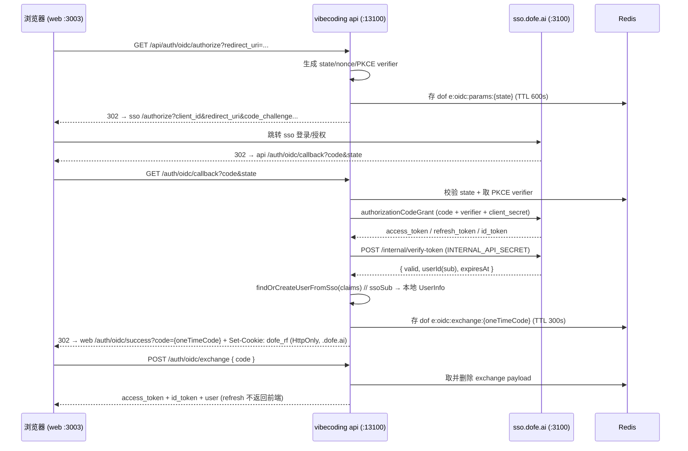

# 02 · 架构设计

> 全面对齐 `models.dofe.ai` 的接入模式。本篇定义「为什么这么做」与关键取舍；具体文件级实施见 [05-sso-auth.md](./05-sso-auth.md)。

## 1. 认证协议：OIDC Authorization Code Flow + PKCE

关键点（对齐 models）：

- `state/nonce/PKCE verifier` 存 Redis（`dofe:oidc:params:{state}`，TTL 600s），防 CSRF。
- scope = `openid profile email tenant offline_access`。
- 回调后由 **api** 完成换 token + 远程校验 + 本地建用户，再生成**一次性 exchange code** 存 Redis（TTL 300s），302 到前端 success 页；前端用 exchange code 换 access_token。
- **refresh_token 永不出现在前端**：api 在 exchange 阶段写入 `dofe_rf` HttpOnly cookie。

## 2. Token 验证策略

### 2.1 决策：远程验证（`verify-token`）

沿用 models 的 `SsoAuthClient.verifyToken()`：

- `AuthGuard` 对每个非 `@Public()` 请求，取 Bearer access_token，`POST {SSO_INTERNAL_API_URL}/internal/verify-token`，header `Authorization: Bearer ${INTERNAL_API_SECRET}` + `X-Service-Name: ${SSO_SERVICE_NAME}`，返回 `{ valid, userId(sub), expiresAt }`。
- 用 `userId(sub)` 调 `UserSyncService.ensureLocalUserExists(ssoSub)` 保证本地 `UserInfo` 存在，并注入 `request.userId / isAdmin / userInfo`。

### 2.2 取舍与风险

| 维度           | 远程 verify-token（采用）     | 本地 JWKS 验签（未来优化）    |
| -------------- | ----------------------------- | ----------------------------- |
| 实现成本       | 低（SDK 现成）                | 中（需 `jose` + 缓存 + 轮换） |
| 延迟           | 每请求同步 HTTP（~5s 超时）   | 本地验签，亚毫秒              |
| 可用性耦合     | sso 抖动直接影响全部 API      | 仅取 key 时依赖 sso           |
| 撤销即时性     | ✅ 立即生效（session 中心化） | ❌ 需黑名单/短 TTL            |
| 与 models 一致 | ✅                            | ❌ 需偏离                     |

> **结论**：先采用远程验证（零偏差、撤销即时）；后续可用 `SsoAuthClient.getJwks()`（已提供）+ `jose` 做本地 JWKS 缓存验签作为性能优化，撤销通过短 access TTL + 黑名单兜底。

## 3. Refresh Token 策略

- 存储：`dofe_rf` cookie，`HttpOnly; Secure( prod ); SameSite=Lax; Path=/; Max-Age=30d; Domain=.dofe.ai`。
- 刷新：api 端点 `POST /auth/oidc/token`（或 `/auth/oidc/refresh`）读 cookie 里的 refresh_token，POST 到 sso `token_endpoint`（带 client_secret）；`invalid_grant`/`invalid_token` → 抛 session 过期（前端跳登录）。
- 前端：`credentials: 'include'` 让 cookie 随请求带上；access_token 过期时由 `token-manager`（`@dofe/sso-browser/token-manager`）触发一次刷新重试。

> 跨子域前提：vibecoding 必须与 sso 同根域 `.dofe.ai`（本地开发用 `vibecoding.test.dofe.ai` 解析 + cookie 域适配）。

## 4. 唯一源原则

### 4.1 用户管理

- 权威源 = sso（用户/租户/会话/角色）。
- vibecoding 本地 `UserInfo` 仅作**缓存映射**：新增 `ssoSub`（`@unique`）作为与 sso 的唯一关联；`nickname/avatar/locale/isAdmin` 等可冗余缓存，但以 sso 为准（`user-sync` 在每次校验/登录时回填）。
- 不在 vibecoding 侧实现注册/改密/邮箱验证等——统一走 sso。

### 4.2 文件管理

- 权威源 = sso 文件服务。
- vibecoding 作为**消费方**，通过 `@dofe/file-sdk`（HTTP）调用 sso：上传、CDN URL、元数据。
- **不**复制 sso 的 `FileDomainModule`/`file-api`/`cdn-proxy`/`internal-file-api`（避免 tenant/team 多租户耦合与重复维护）。
- 现有 vibecoding `UploaderModule` 的去留在 [04-file-management.md](./04-file-management.md) 评估。

## 5. 技术栈与共享包

### 后端（apps/api）

| 包                            | 来源                    | 用途                                                                                               |
| ----------------------------- | ----------------------- | -------------------------------------------------------------------------------------------------- |
| `@dofe/infra-clients`         | npm ^0.1.56（已依赖）   | `SsoAuthClient`/`SsoClientModule`（`/sso` 子路径）、`FileGcsClient` 等 storage client              |
| `@dofe/infra-shared-services` | npm ^0.1.56（已依赖）   | `FileCdnModule`/`FileCdnClient`（**修 import bug**）、`FileStorageServiceModule`、`UploaderModule` |
| `@dofe/infra-common`          | npm ^0.1.56（已依赖）   | `AuditLogInterceptor`/`OPERATE_LOG_SERVICE_TOKEN`、`HttpExceptionFilter`                           |
| `@dofe/infra-jwt`             | npm ^0.1.56（已依赖）   | `JwtModule`（decode access_token 用于 logout）                                                     |
| `@dofe/infra-redis`           | npm ^0.1.56（已依赖）   | OIDC state/exchange-code 存储                                                                      |
| `@dofe/sso-node`              | npm ^0.1.43（**新增**） | `createSsoLegacyClient`（RBAC/团队/用户 internal API 包装）                                        |
| `@dofe/sso-nestjs`            | npm ^0.1.43（**新增**） | `@dofe/sso-node` 的 NestJS 模块封装（`@app/sso-client` 依赖，实施时按 models `package.json` 对齐） |
| `@dofe/sso-contracts`         | npm ^0.1.66（**新增**） | ssoClient 枚举契约（如需）                                                                         |
| `@dofe/file-sdk`              | npm ^0.1.7+（**新增**） | 文件消费 SDK                                                                                       |
| `openid-client`               | npm ^6.8.4（**新增**）  | discovery / authorizationCodeGrant / PKCE                                                          |
| `@fastify/cookie`             | npm（**新增**）         | `dofe_rf` HttpOnly cookie                                                                          |

### 前端（apps/web）

| 包                                 | 来源                          | 用途                                                                 |
| ---------------------------------- | ----------------------------- | -------------------------------------------------------------------- |
| `@dofe/sso-browser`                | npm ^0.1.56（**新增**）       | `createTokenManager`、`checkSsoSession`/`checkSsoSessionViaIframe`   |
| `@dofe/sso-contracts`              | npm ^0.1.66（**新增**）       | `oidcAuthContract` 等                                                |
| `@dofe/sso-hooks` / `@dofe/sso-ui` | npm ^0.1.5x（**新增**，按需） | SSO 相关 React hooks / UI 组件（登录态、租户切换等，按界面需要引入） |
| `@dofe/file-sdk-web`               | npm ^0.1.7+（**新增**，按需） | 前端文件上传                                                         |

### 本仓库需新增的共享产物

- `@repo/contracts`：新增 `oidcAuthContract`（exchange/token/refresh/logout/authorize/clear-session）。
- `@repo/constants`：新增 OIDC 前缀/TTL 常量（`OIDC_PARAMS_KEY_PREFIX`、`OIDC_EXCHANGE_CODE_PREFIX/TTL_S`、`TOKEN_BLACKLIST_PREFIX`、`ACCESS_TOKEN_DEFAULT_EXPIRY_S`、`REFRESH_TOKEN_DEFAULT_EXPIRY_MS`、`isSsoRefreshTokenExpired`）。
- `@repo/contracts` 的 `UserInfo` schema：补 `ssoSub`。
