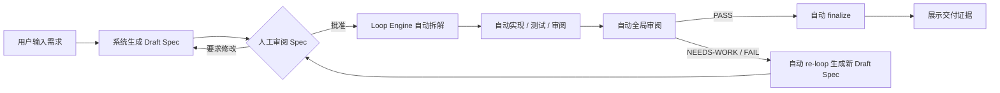
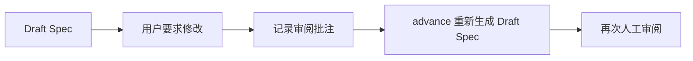
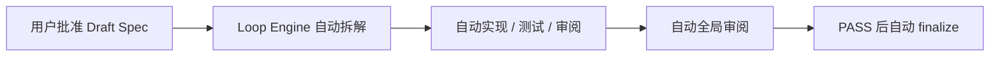
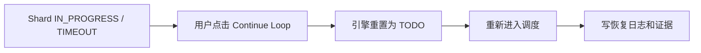

# 02 · 用户旅程

## Happy Path



用户视角只有四类动作：

1. 创建需求；
2. 审阅 Spec；
3. 在异常时做决策；
4. 查看交付证据。

## Detail 页信息架构

### 顶部摘要

目的：让用户知道“这是哪个 issue、当前处于什么阶段、有没有暂停”。

建议展示：

- issue id、状态、phase；
- 标题与原始需求；
- round、spec version、shards done/total、calls、tokens、paused。

### Flow Status

目的：让用户知道“现在谁在工作、工作到哪里”。

建议展示：

- 当前 phase；
- 当前执行者：Codex / Claude Code / System / Human；
- runtime 模式；
- active shard；
- 最近事件；
- phase timeline。

注意：执行者是状态解释，不是要求用户去切换 agent。

### Spec Review

目的：唯一默认人工批准点。

状态设计：

| 状态               | UI                                    |
| ------------------ | ------------------------------------- |
| 无 Spec            | 空态说明，主按钮可生成 Spec           |
| Draft              | 显示完整 Spec，提供“批准”和“要求修改” |
| Revision requested | 主按钮可重新生成 Draft Spec           |
| Approved           | 展示已批准状态，不再要求用户操作      |

> 落地状态（2026-06-22）：四态已全部实现于 `apps/web/app/loops/[issueId]/page.tsx` 的 Spec Review 区。无 Spec 与 Revision requested 仅解释「使用 Continue Loop 生成/重新生成草稿」，推进统一由右侧主按钮调用 `advance`；Draft 渲染批准+请求修改；Approved 转只读并提示引擎自动推进。前端 Spec 四态有渲染测试覆盖（`page.test.tsx`）。

### Shards

目的：展示引擎进度和证据，不提供手动填写。

每个 shard 卡片展示：

- 标题；
- 状态；
- context / dependency 数量；
- implementation/test/review 证据计数；
- 当前自动化步骤；
- 最新测试和审阅结果；
- 前 3 条 acceptance snippets。

不展示：

- 接管；
- 记录实现；
- 运行 shard tests；
- 记录审阅。

### Evidence Coverage

目的：回答“系统是否留下足够证据”。

建议展示：

- implemented x/y；
- tested x/y；
- reviewed x/y；
- annotated x/y；
- artifacts 分组：request、planning、implementation、test、review、delivery。

### Resume Checkpoints

目的：让用户理解恢复点，而不是让用户手动修复内部状态。

建议展示：

- 当前 checkpoint；
- 上次事件；
- 恢复动作；
- round/spec 差异；
- blocked/failing/passing 统计。

### Trace Timeline

目的：给工程负责人和管理员审计。

默认折叠或放在侧栏下方即可，不要压过主任务。

## 右侧主操作区

### 推荐结构

```text
Next Action
<状态标签>
<一句说明>

[Continue Loop]   primary
[Pause] [Resume]  secondary safety controls

<如果不能继续，展示原因和下一步>
```

### 主按钮规则

| 当前状态                  | 主按钮行为                                               |
| ------------------------- | -------------------------------------------------------- |
| 无 Spec                   | 调用 `advance` 生成 Draft Spec                           |
| Spec Draft                | 禁用主按钮，提示审阅 Spec                                |
| Spec Approved 且无 shards | 调用 `advance` 自动拆解并继续到下一人工关卡或终态        |
| 有 runnable shard         | 调用 `advance` 自动运行调度并继续推进                    |
| 有 interrupted shard      | 调用 `advance` 自动恢复并继续调度                        |
| phase = PHASE_6_CONVERGE  | 调用 `advance` 自动 global review，并在 PASS 后 finalize |
| globalVerdict = PASS      | 调用 `advance` 自动 finalize                             |
| globalVerdict 非 PASS     | 禁用主按钮，引导 re-loop 或异常决策                      |
| CLOSED                    | 禁用主按钮，展示证据                                     |

## 异常旅程

### Spec 被要求修改



关键文案：

> 已记录修改意见。继续推进后，系统会生成下一版 Draft Spec，并再次等待你批准。

### Spec 被批准



关键文案：

> Spec 已批准。Loop Engine 会自动推进拆解、实现、测试、审阅和终态证据；只有遇到新的人工关卡或异常决策时才会停下。

### Shard 中断



关键文案：

> 发现中断的执行单元，Loop Engine 会自动恢复并继续调度，不需要手动填写证据。

### Global Review 非 PASS


关键文案：

> 全局审阅发现剩余工作。系统会将问题转为下一版 Spec 草稿，等待你确认新的修复方向。

## 文案原则

| 不推荐                | 推荐                                         |
| --------------------- | -------------------------------------------- |
| Run Step              | Continue Loop                                |
| No runnable shard     | 当前没有可自动推进的工作，原因是依赖尚未完成 |
| Take over shard       | 请求人工介入                                 |
| Record implementation | 查看实现证据                                 |
| Run shard tests       | 查看测试证据                                 |
| Review shard          | 查看审阅证据                                 |

> 落地状态（2026-06-22）：文案原则已在前端 i18n（`apps/web/locales/{en,zh-CN}/loops.json`）与 Detail 页落地：
>
> - 主推进按钮为「Continue Loop / 继续推进」，无独立 Run Step 按钮；
> - `Pause` / `Resume` 保持 secondary safety controls；即使 loop 已暂停，`Resume` 也不会升级为 primary action，页面仍只有一个主推进按钮；
> - `runDiagnostics.none` 改为「当前没有可自动推进的工作，通常是依赖尚未完成」；
> - `resumeCheckpoints.resumeOrTakeOver` 由「Resume or take over / 恢复或接管」改为「Auto-resume / 自动恢复」；
> - 证据工件提示 `artifacts.hints.{implementationRecord,testRecord,reviewRecord}` 由「记录/运行」改为「查看实现/测试/审阅证据」；
> - `runDiagnostics.recovering`、`runDiagnostics.ready`、`runDiagnostics.{shards,complete}` 与 `shards.automation.attention.body` 中的「Run Step / 执行一步 / Decompose / Finalize」改为「Continue Loop / 继续推进 / 完成交付」；
> - Next-Action 与 dashboard action queue 标题的内部 phase 词汇（decompose/globalReview/runStep/finalize）已改为用户语义（规划工作/最终审阅/继续推进/完成交付），并由 API service 与前端 dashboard model 测试覆盖；
> - Detail 页操作 hook（`use-loop-operations.ts`）不再绑定 `generateSpec` / `decompose` / `runLoop` / `reviewGlobal` / `finalize` 等细粒度 mutations；默认推进只保留 `advanceLoop`，Spec 审阅只保留 approve/request-revision；
> - 保留的细粒度 contract summary、hook 名称/注释和后端内部异常仍可使用 implementation evidence / scheduler endpoint / No runnable shard 等工程语义，因为这些入口服务 CLI、管理员、兼容调用方或错误诊断，不属于普通用户默认路径。
