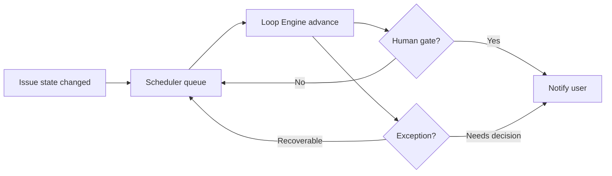

# 03 · 引擎与接口边界

## 分层目标

Loop Engineering 需要把“用户体验语义”和“内部执行语义”分开：

- 用户体验语义：创建需求、审阅 Spec、继续推进、处理异常、查看证据；
- 内部执行语义：generateSpec、decompose、runLoop、runShardTests、reviewShard、reviewGlobal、reloop、finalize。

前端默认使用用户体验语义。内部端点继续保留给 CLI、管理员工具、测试和兼容调用方。

## 核心接口：advance

`POST /loops/issues/:issueId/advance` 是产品级推进接口。它不是“只跑一个内部步骤”，而是尽可能把 Loop 推进到下一个人工关卡、异常决策点或终态。

### 决策表

| 当前状态                            | `advance` 行为                             |
| ----------------------------------- | ------------------------------------------ |
| paused                              | 自动恢复 issue 状态并继续推进              |
| CLOSED                              | 返回当前 detail，不做变更                  |
| 无 Spec                             | 调用 `generateSpec`，停在 Draft Spec 人审  |
| Spec = REVISION_REQUESTED           | 调用 `generateSpec`，停在 Draft Spec 人审  |
| Spec = DRAFT                        | 返回当前 detail，等待人工审阅              |
| Spec 非 APPROVED                    | 返回明确错误                               |
| APPROVED 且无 shards                | 调用 `decompose` 后继续推进                |
| phase = PHASE_3_DECOMPOSE           | 调用 `decompose` 后继续推进                |
| globalVerdict = PASS 且未 finalized | 调用 `finalize` 后返回终态                 |
| phase = PHASE_6_CONVERGE            | 调用 `reviewGlobal`，PASS 后继续 finalize  |
| globalVerdict 非 PASS               | 返回当前 detail，等待 re-loop 或异常决策   |
| 其他执行态                          | 调用 `runLoop`，循环推进直到人工关卡或终态 |

### 设计原因

`advance` 将“下一步应该做什么”的判断放在后端，因为：

- 后端拥有完整 state、spec、shards、records、logs；
- 前端不应该复制状态机；
- CLI、Web、未来 worker 都可以复用同一决策；
- 审计日志统一记录；
- 新增 phase 时只需更新 engine，不让页面散落条件判断。

`reviewSpec(approve)` 会在写入 APPROVED 后调用 `advance`，因此用户批准 Spec 后不需要再次点击“继续推进 Loop”。旧的细粒度端点仍保留，但 `decompose` / `runLoop` / `reviewGlobal` / `finalize` 在 CLOSED 后必须幂等返回，避免兼容调用方把终态状态倒退。

## Shard 自动化

### Shard 的系统职责

Shard 用于：

- 控制上下文预算；
- 表达依赖 DAG；
- 限定实现范围；
- 绑定测试要求；
- 生成 implementation/test/review 证据；
- 支持失败重试和 re-loop。

### Shard 的用户职责

默认没有用户职责。

用户只在以下情况下介入：

- Spec 不准确，需要修改；
- 运行环境不可用，需要管理员配置；
- 成本或回环上限触发，需要决策；
- 交付目标变化，需要新一轮需求确认。

### 中断恢复

`runLoop` 应在找不到 runnable shard 时检查 `IN_PROGRESS` / `TIMEOUT`：

1. 将可恢复 shard 重置为 `TODO`；
2. `shardsInProgress` 归零；
3. 写 `SCHEDULER_RECOVERED_INTERRUPTED_SHARDS` 日志；
4. 继续调度。

这避免用户看到“已处于进行中，通常是人工接管后的状态，请先记录实现证据或完成审阅”的死胡同。

## 证据真相源

`.loops` 仍是文件真相源，Web/API 是其可视化和操作面。

关键证据：

| 证据                  | 生成者                       | 用户是否手填 |
| --------------------- | ---------------------------- | ------------ |
| Issue / Intake        | 系统                         | 否           |
| Spec                  | Codex / Loop Engine          | 用户只审阅   |
| Shards / DAG          | Codex / Loop Engine          | 否           |
| Test Matrix           | Codex / Loop Engine          | 否           |
| Implementation Record | Claude Code / runner adapter | 否           |
| Test Record           | Runner                       | 否           |
| Review Record         | Codex reviewer               | 否           |
| Global Review         | Codex reviewer               | 否           |
| Convergence PR record | Git adapter / Loop Engine    | 否           |
| Annotations           | Loop Engine                  | 否           |

## API 边界

### 推荐默认入口

| 场景               | API                                         |
| ------------------ | ------------------------------------------- |
| 创建简单需求       | `POST /loops/issues/simple`                 |
| 查看详情           | `GET /loops/issues/:issueId`                |
| 推进               | `POST /loops/issues/:issueId/advance`       |
| 审阅 Spec          | `POST /loops/issues/:issueId/spec/review`   |
| 暂停/恢复/人工介入 | `POST /loops/issues/:issueId/interventions` |
| 查看 runtime       | `GET /loops/agent-runtime`                  |
| 查看 doctor        | `GET /loops/doctor`                         |

### 保留但不作为默认 UI 的端点

| API                                                          | 用途                  |
| ------------------------------------------------------------ | --------------------- |
| `POST /loops/issues/:issueId/spec`                           | CLI / debug 生成 Spec |
| `POST /loops/issues/:issueId/decompose`                      | CLI / debug 拆解      |
| `POST /loops/issues/:issueId/run`                            | CLI / debug 单步调度  |
| `POST /loops/issues/:issueId/shards/:shardId/tests`          | 管理员 / 兼容测试入口 |
| `POST /loops/issues/:issueId/shards/:shardId/implementation` | 兼容外部系统写入证据  |
| `POST /loops/issues/:issueId/shards/:shardId/review`         | 兼容外部审阅系统      |
| `POST /loops/issues/:issueId/global-review`                  | CLI / debug 全局审阅  |
| `POST /loops/issues/:issueId/finalize`                       | CLI / debug finalize  |

## 状态机原则

### 前端原则

- 不复制完整状态机；
- 只判断是否显示人工审阅、异常提示和主按钮禁用；
- 主推进动作统一调用 `advance`；
- shard 卡片只读。

### 后端原则

- 所有状态推进写日志；
- 所有证据写 `.loops`；
- 所有外部输入用 contract schema 验证；
- DB 只通过 DB service / persistence 层；
- external agent / runner 只通过 adapter/client 层；
- 不在 service 中泄漏 runtime 机密。

## 后台自动推进的下一步

当前已具备同步自动推进：用户批准 Spec 后，API 调用会在同一请求中推进到下一人工关卡或终态。下一阶段应引入真正的后台队列 worker，把长任务从 HTTP 请求中解耦：

用户点击按钮只是唤醒或重试，不是驱动每一步的必要条件。
