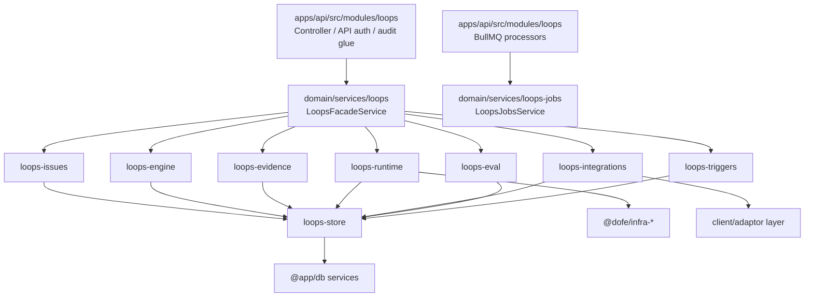

# Loops 结构优化拆分方案

## 背景

当前 `apps/api/src/modules/loops` 同时承载 API controller、Nest module 装配、核心状态机、文件存储、DB persistence、runtime 检测、Docker、MCP、CI、Eval、Trigger、Archive、Worker、Adapter 和若干纯工具函数。

截至 2026-06-26 的主要结构事实：

- `loops.service.ts` 约 8000 行，公开方法覆盖 issue、engine、runtime、remote runner、MCP、CI、Eval、trigger、workspace、tool、blueprint 等多个业务域。
- `loops.module.ts` 同时 import HTTP、DB、AuditLog、BullMQ queue，并注册 20+ provider。
- `apps/api/libs/domain/services` 已存在 `ip-info` 形态：一个目录内保留 `1 service + 1 module + n` 附属文件，并通过 `@app/services/*` alias 暴露。
- 项目约束要求依赖方向保持为 `src -> domain -> @dofe/infra-*`，DB 访问必须走 DB service 层，外部 API 调用放在 client/adaptor 层，不在业务 service 中直接发起。

本方案目标是把 loops 领域能力按边界下沉到 `apps/api/libs/domain/services`，同时让 `apps/api/src/modules/loops` 回到 API 装配层，降低循环引用和模块杂糅风险。

执行拆分时使用 [EXECUTION.md](./EXECUTION.md)，其中每一步固定包含目标、范围、不做、受益四个部分。

## 目标

1. `apps/api/src/modules/loops` 只保留 API 层和 Nest 装配层职责：
   - `loops.controller.ts`
   - `loops.module.ts`
   - BullMQ processor / HTTP queue bridge
   - API-only decorator / guard / audit glue
2. 领域能力迁移到 `apps/api/libs/domain/services/loops-*` 或 `apps/api/libs/domain/services/loops/<area>`。
3. 每个领域目录遵守 `1 + 1 + n`：
   - 1 个 `*.service.ts`
   - 1 个 `*.module.ts`
   - n 个同域附属文件：`*.token.ts`、`*.interface.ts`、`*.util.ts`、`*.spec.ts`、`index.ts`
4. 禁止横向互相 import 造成环：
   - 上层 facade 可以依赖下层能力；
   - 下层能力不得反向依赖 facade、controller、processor；
   - domain service 不 import `apps/api/src/modules/**`。
5. 对外 contract 和 controller 行为保持兼容，拆分过程以重构为主，不改用户可见 API。

## 分层边界



### API 层保留

| 文件/职责                 | 保留原因                                                                       |
| ------------------------- | ------------------------------------------------------------------------------ |
| `loops.controller.ts`     | ts-rest contract 实现、Auth、permission、审计上下文都属于 API 边界             |
| `loops.module.ts`         | Nest app 装配入口，负责 import domain modules、queue modules 和 provider alias |
| `loops-rbac.decorator.ts` | controller 权限声明，贴近 HTTP/API 层                                          |
| `*.processor.ts`          | BullMQ processor 是 worker 入口，可调用 domain job service，但不承载业务逻辑   |

### Domain 层下沉

| 当前能力                                         | 目标目录                                             | 说明                                                                             |
| ------------------------------------------------ | ---------------------------------------------------- | -------------------------------------------------------------------------------- |
| issue list/detail/create/simple/webhook 基础构造 | `apps/api/libs/domain/services/loops-issues`         | issue intake、submitter 归一化、文件/DB 双写编排                                 |
| loop 状态机推进                                  | `apps/api/libs/domain/services/loops-engine`         | `generateSpec`、`reviewSpec`、`decompose`、`runLoop`、`advance`、`finalize`      |
| 文件真相源 + persistence facade                  | `apps/api/libs/domain/services/loops-store`          | `.loops` file store、DB index persistence token、读写一致性                      |
| work lock                                        | `apps/api/libs/domain/services/loops-locks`          | in-memory / Redis backend token 与工作锁 service                                 |
| runner / agent / git adapter 编排                | `apps/api/libs/domain/services/loops-runners`        | agent adapter ports、runtime command builder、git adapter 编排                   |
| workspace/runtime/docker                         | `apps/api/libs/domain/services/loops-runtime`        | runtime detection、workspace profile、Docker client/sandbox                      |
| delivery evidence / gates / coverage             | `apps/api/libs/domain/services/loops-evidence`       | delivery evidence、review/release gates、requirements coverage、artifact builder |
| browser QA / second opinion / learning           | `apps/api/libs/domain/services/loops-quality`        | QA worker、二审策略、learning governance                                         |
| eval suite / aggregation / bench trend           | `apps/api/libs/domain/services/loops-eval`           | Eval suite/run 构建、aggregation worker domain 逻辑                              |
| MCP / CI / PR provider / notifications           | `apps/api/libs/domain/services/loops-integrations`   | external integration client/adaptor 聚合，外部 HTTP 保持 client 层               |
| trigger / schedule / retry / dead-letter         | `apps/api/libs/domain/services/loops-triggers`       | webhook/schedule trigger、rate limit、signature、retry                           |
| remote runner pool                               | `apps/api/libs/domain/services/loops-remote-runners` | runner list、lease、job、artifact upload                                         |
| archive/admin/tool/blueprint                     | `apps/api/libs/domain/services/loops-admin`          | 跨租户 archive、tool registry、blueprint 管理、admin action                      |
| controller 兼容 facade                           | `apps/api/libs/domain/services/loops`                | 对 controller 暴露现有 `LoopsService` 等价 facade，迁移期间减少 controller diff  |

## 推荐目录形态

第一阶段使用扁平 `loops-*` 目录，直接匹配现有 `@app/services/*` alias，避免额外 tsconfig 改动。

```text
apps/api/libs/domain/services/
  index.ts
  loops/
    index.ts
    loops.module.ts
    loops.service.ts
  loops-store/
    index.ts
    loops-store.module.ts
    loops-store.service.ts
    loops-persistence.token.ts
    loops-persistence.interface.ts
    loops-file-store.service.ts
  loops-issues/
    index.ts
    loops-issues.module.ts
    loops-issues.service.ts
    loops-simple-issue.spec.ts
  loops-engine/
    index.ts
    loops-engine.module.ts
    loops-engine.service.ts
    loops-engine.types.ts
  loops-runners/
    index.ts
    loops-runners.module.ts
    loops-runners.service.ts
    adapters/
    runtime-command-builder.util.ts
  loops-runtime/
    index.ts
    loops-runtime.module.ts
    loops-runtime.service.ts
    agent-runtime-detection.service.ts
    loops-workspace-profile.service.ts
    loops-docker.client.ts
    loops-docker-sandbox.service.ts
  loops-evidence/
    index.ts
    loops-evidence.module.ts
    loops-evidence.service.ts
    loops-second-opinion-comparison.util.ts
    loops-visual-regression.util.ts
  loops-quality/
    index.ts
    loops-quality.module.ts
    loops-quality.service.ts
    loops-browser-qa-worker.service.ts
    loops-second-opinion-worker.service.ts
    loops-learning-governance.service.ts
  loops-eval/
    index.ts
    loops-eval.module.ts
    loops-eval.service.ts
    loops-eval-aggregation-worker.service.ts
  loops-integrations/
    index.ts
    loops-integrations.module.ts
    loops-integrations.service.ts
    loops-pr-provider.client.ts
    loops-mcp-client.service.ts
    loops-mcp-secret.service.ts
    loops-notification-sender.service.ts
  loops-triggers/
    index.ts
    loops-triggers.module.ts
    loops-triggers.service.ts
  loops-remote-runners/
    index.ts
    loops-remote-runners.module.ts
    loops-remote-runners.service.ts
  loops-admin/
    index.ts
    loops-admin.module.ts
    loops-admin.service.ts
    loops-cross-tenant-archive.service.ts
```

说明：

- `loops/loops.service.ts` 是兼容 facade，短期保留 controller 现有调用面；它只编排其他 domain service，不放私有业务算法。
- 每个目录只有一个 module 和一个主 service；附属 worker/client/util 可以作为该目录内部 provider 或纯函数存在。
- 如果某目录继续膨胀，优先按能力再拆成新的 `loops-*` 目录，而不是在一个 module 中堆多个主 service。

## Provider 装配原则

### Domain module

每个 domain module 只 export 主 service，必要时 export token。

```ts
@Module({
  imports: [LoopsStoreModule],
  providers: [LoopsIssuesService],
  exports: [LoopsIssuesService],
})
export class LoopsIssuesModule {}
```

### API module

`apps/api/src/modules/loops/loops.module.ts` 最终只做应用装配：

```ts
@Module({
  imports: [
    HttpModule,
    BullModule.registerQueue({ name: 'loops-eval-aggregation' }),
    BullModule.registerQueue({ name: 'loops-remote-runner' }),
    BullModule.registerQueue({ name: 'loops-trigger-scheduler' }),
    LoopsDomainModule,
  ],
  controllers: [LoopsController],
  providers: [
    LoopsEvalAggregationProcessor,
    LoopsRemoteRunnerProcessor,
    LoopsTriggerSchedulerProcessor,
  ],
})
export class LoopsModule {}
```

### Processor

processor 只解析 queue payload 并调用 domain service：

```ts
@Processor('loops-eval-aggregation')
export class LoopsEvalAggregationProcessor {
  constructor(private readonly jobs: LoopsJobsService) {}
}
```

## 依赖规则

| 规则            | 允许                                                      | 禁止                                         |
| --------------- | --------------------------------------------------------- | -------------------------------------------- |
| API 到 domain   | `apps/api/src/modules/loops` import `@app/services/loops` | domain import controller/processor/decorator |
| domain 到 DB    | 通过 `@app/db` generated service 或现有 persistence token | raw `prisma.read` / `prisma.write`           |
| domain 到 infra | 使用 `@dofe/infra-*` published APIs                       | 复制 infra ownership 到本 repo               |
| 外部 HTTP       | 通过 client/adaptor provider                              | 业务 service 直接 `fetch`                    |
| cross domain    | facade 依赖子 service，子 service 依赖 store/ports        | 子 service 互相循环依赖                      |
| contracts       | 继续从 `@repo/contracts` 引入类型                         | 在 domain 重定义 API schema                  |

## 迁移顺序

### P0 · 建立兼容 facade 和空模块

目标：先建立目标目录和 module graph，不搬大逻辑。

验收：

- `apps/api/libs/domain/services/index.ts` export loops domain 入口。
- `apps/api/src/modules/loops/loops.module.ts` 可以 import `LoopsDomainModule`。
- controller 仍只调用一个 `LoopsService` facade。
- `pnpm --filter @repo/api type-check` 通过。

### P1 · 下沉低耦合工具和 store

目标：先移动最少依赖、最容易验证的文件。

候选：

- `loops-runtime-config.util.ts`
- `loops-runtime-command-builder.util.ts`
- `loops-workspace-root.util.ts`
- `loops-path-policy.util.ts`
- `loops-file-store.service.ts`
- `loops-persistence.*`
- `loops-work-lock.service.ts`
- `in-memory-loops-lock.backend.ts`
- `redis-loops-lock.backend.ts`

验收：

- 相关 spec 跟随移动并通过。
- API 层不再直接持有 file-store / lock provider。
- 无 `apps/api/libs/domain/services/**` import `apps/api/src/modules/**`。

### P2 · 拆 issue intake 与 query

目标：把 `list`、`getIssue`、`createIssue`、`createSimpleIssue`、submitter 归一化和 workspace targetRepo 解析移到 `loops-issues`。

验收：

- `LoopsService` facade 的 issue 方法只转发或做轻量编排。
- `loops-simple-issue.spec.ts`、`loops.service.spec.ts` 对应断言仍通过。
- API contract 不变。

### P3 · 拆 engine 状态机

目标：把 phase 推进和 shard 调度从 facade 中抽到 `loops-engine`。

范围：

- `generateSpec`
- `reviewSpec`
- `decompose`
- `runLoop`
- `advance`
- `reviewGlobal`
- `reloop`
- `finalize`
- shard recovery / runnable shard / cost guard

验收：

- engine 只依赖 store、runners、evidence、quality、locks，不依赖 controller。
- CLOSED 后幂等语义保持。
- 关键 loops service specs 通过。

### P4 · 拆 runtime、runner、quality、evidence

目标：把 runtime 可诊断资产和交付证据构建能力独立。

验收：

- `agentRuntime`、workspace、Docker、pull image 由 `loops-runtime` 提供。
- agent/claude/git adapters 由 `loops-runners` 提供。
- `getDeliveryEvidence`、review gates、release gates、coverage 由 `loops-evidence` 提供。
- browser QA、second opinion、learning governance 由 `loops-quality` 提供。

### P5 · 拆运营域：eval、integrations、triggers、remote runners、admin

目标：把 dashboard/运营控制面能力从主 service 中移出。

验收：

- Eval suite/run/aggregation 由 `loops-eval` 提供。
- MCP/CI/PR/notification 由 `loops-integrations` 提供。
- webhook/schedule/retry/dead-letter 由 `loops-triggers` 提供。
- remote runner lease/job/artifact 由 `loops-remote-runners` 提供。
- archive/tool/blueprint/admin action 由 `loops-admin` 提供。

### P6 · 收敛 API module

目标：清空 `apps/api/src/modules/loops` 中的领域 provider。

验收：

- `apps/api/src/modules/loops` 剩余文件只属于 API/worker entry。
- `loops.module.ts` providers 数量显著下降，只含 controller 周边 provider 和 processor。
- `loops.service.ts` 原文件不再位于 API 层。
- `pnpm quality:gate` 通过。

## 循环引用防线

迁移期间建议加入脚本或 CI 检查：

```bash
rg "apps/api/src/modules/loops|src/modules/loops|\\.\\./\\.\\./\\.\\./src/modules/loops" apps/api/libs/domain/services
```

期望结果为空。

同时对 domain services 保持以下方向：

```text
loops facade
  -> issues / engine / runtime / integrations / eval / triggers / admin
      -> store / locks / runners / evidence / quality
          -> @app/db / @dofe/infra-* / @repo/contracts
```

如果发现两个 `loops-*` 目录需要互相依赖，优先抽出更底层的 port/interface/token 放到被共同依赖的目录，而不是使用 `forwardRef` 掩盖循环。

## 测试策略

每个迁移批次先跑窄测试，再跑 API type-check：

```bash
pnpm --filter @repo/api test -- loops
pnpm --filter @repo/api type-check
```

架构收敛或 release-facing 批次跑：

```bash
pnpm quality:gate
```

建议新增的结构测试：

- domain services 不 import `apps/api/src/modules/**`。
- API `loops.module.ts` 不直接注册已下沉的领域 provider。
- 每个 `apps/api/libs/domain/services/loops-*` 目录必须包含 exactly one `*.module.ts` 和 one 主 `*.service.ts`。

## 风险与处理

| 风险                                    | 影响 | 处理                                                          |
| --------------------------------------- | ---- | ------------------------------------------------------------- |
| 一次性搬动 8000 行 service 导致行为回归 | 高   | facade 兼容迁移，按 P1-P6 小批次验证                          |
| Nest provider token 迁移时注入断裂      | 高   | 先建立 domain module exports，再切 API module imports         |
| adapter/client 与 service 边界不清      | 中   | 外部 HTTP/API 保留 `*.client.ts` / adapter，主 service 只编排 |
| DB persistence 被误搬成 raw Prisma      | 高   | `loops-store` 继续通过 `@app/db` 和 persistence token         |
| 子域之间出现双向依赖                    | 高   | 使用 port/token 抽底层边界，禁止 `forwardRef` 作为默认解法    |
| spec 路径迁移影响 Jest 匹配             | 中   | spec 跟随文件移动，保持测试命名；每批跑 loops focused test    |

## 完成定义

- `apps/api/src/modules/loops` 不再包含业务算法和长期状态构建逻辑。
- `apps/api/libs/domain/services` 下每个 loops 子域满足 `1 module + 1 service + n`。
- controller 的 ts-rest contract、Auth、AuditLog 行为保持兼容。
- 所有 DB 访问仍通过 DB service / persistence 层。
- domain services 到 API modules 的反向 import 为零。
- focused loops tests、API type-check、最终 `pnpm quality:gate` 通过。
